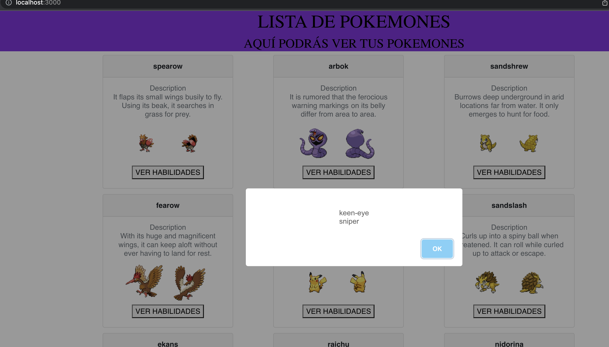
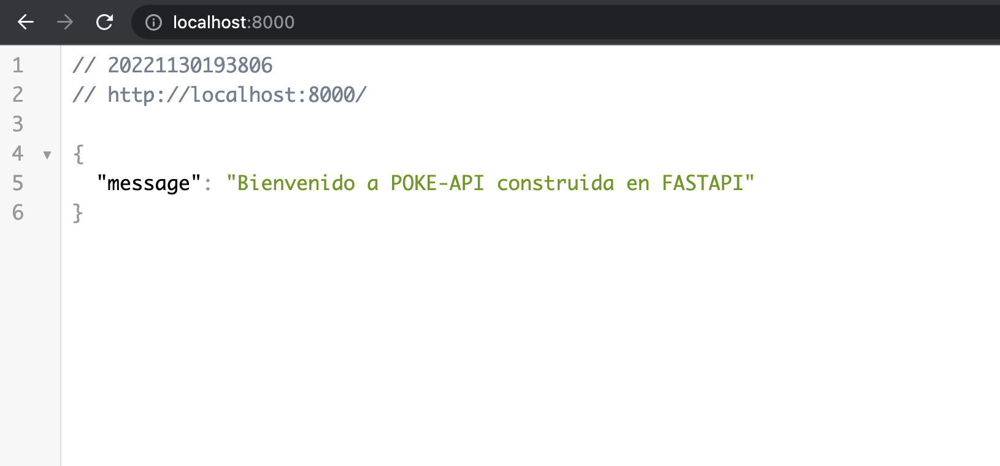
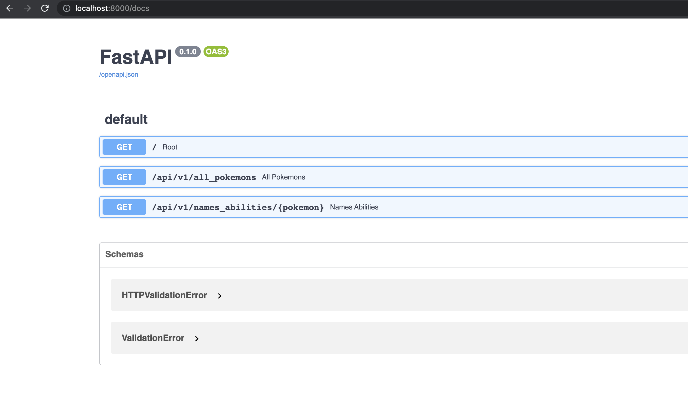
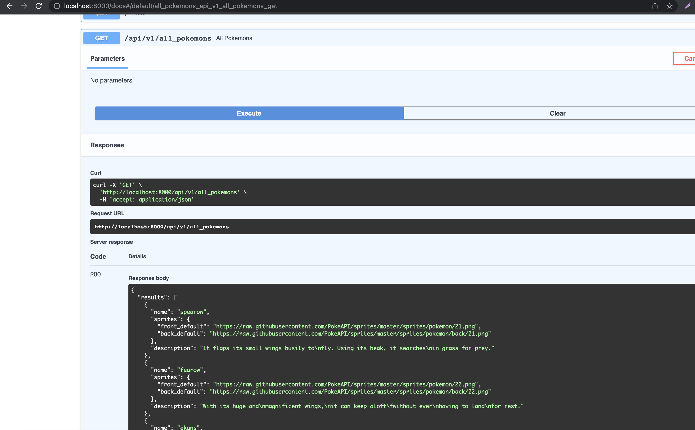
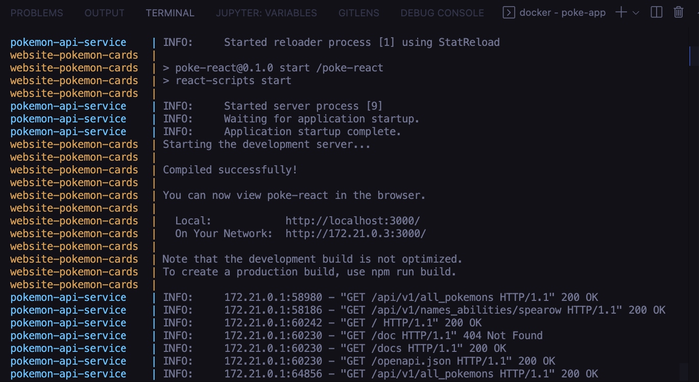

## POKEMON DEVOPS CHALLENGE 

La empresa ZERO Technology, solicita al Equipo de DevOps Trainer, la contenerizacion de su aplicacion "Pokemon DevOps" en la que incluye:

- Backend
- Frontend

### Especificaciones:

- El Backend esta realizado en FASTAPI y Python (python:3.8 ó superior) usando la API publica HTTPS://POKEAPI.CO/API/V2/

- El frontend es realizado en React (node 14 ó 16)

### Requerimientos: 

- Se debe contenerizar la aplicación, para ello se debe crear un dockerfile para el backend y frontend

- Para construir un contenedor del backend ejecutamos lo siguiente:

```
cd backend-pokemon-app
docker build -t backend_pokemon .

```

Este comando debe ser ejecutado en la raiz del directorio backend-pokemon-app  ya que el . indica que el dockerfile se encuentra ahi.
una vez echo esto se crea un contenedor a partir de la imagen construida anteriormente

```
docker run -d -p 8000:8000 backend_pokemon
```

- luego podra ir a la ruta http://localhost:8000 y ver la API funcionando, para
obtener documentacion de la api vaya a la ruta http://localhost:8000/docs


- Este proceso se debe seguir para desplegar el frontend en un container por separado este comando debe ser ejecutado en la raiz del directorio frontend-pokemon-app  ya que el . indica que el dockerfile se encuentra ahi.

```
docker build -t frontend_pokemon .
```

- Una vez echo esto se crea un contenedor a partir de la imagen construida anteriormente

```
docker run -d -p 3000:3000 frontend_pokemon
```

- Para acceder podra ir a la ruta http://localhost:3000 y podra ver el sitio web
el cual internamente se conecta a la API que previamente ya se desplego en un container aparte y tiene expuesto el puerto 8000

- Para el frontend en la ruta frontend-pokemon-app/poke-react
se encuentra el archivo .env el cual contiene 2 variables de entorno que indican
el entorno en que se quiere ejecutar 

- En la ruta frontend-pokemon-app/components en el archivo PokeCard.js
reemplazar process.env.REACT_APP_URL_PRODUCTION por process.env.REACT_APP_URL_DEVELOPMENT

- y en la ruta ruta frontend-pokemon-app/src/App.js reemplazar process.env.REACT_APP_URL_PRODUCTION 
por process.env.REACT_APP_URL_DEVELOPMENT

- Esto hara que el frontend se comunique al servicio expuesto en docker-compose, ya que desea ejecutarlo localmente


### Requisitos:

Tener instalado docker y docker-compose

una vez teniendo estas herramientas ejecutar
```
docker-compose up -d
```

- Cuando finalice el proceso ir a la ruta http://localhost:3000 y obtendra el sitio web el cual esta comunicandose con el container del puerto  8000 de la api pero esta vez los containers estan siendo gestionados por docker-compose

### Entregable

- Dockerfile Frontend y Backend
- Subir la Imagen del Frontend y Backend al Registry Docker Hub
- Docker-compose
- Opcional *script que permita construir la imagen, tagear y subirla al registry
- Documentación y Arquitectura

## Resultado







